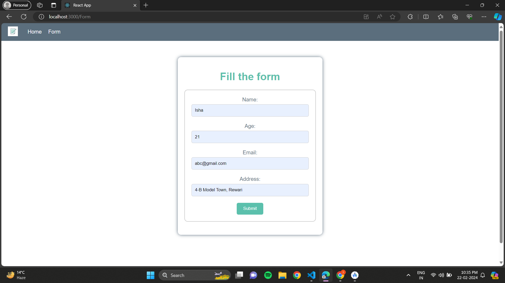
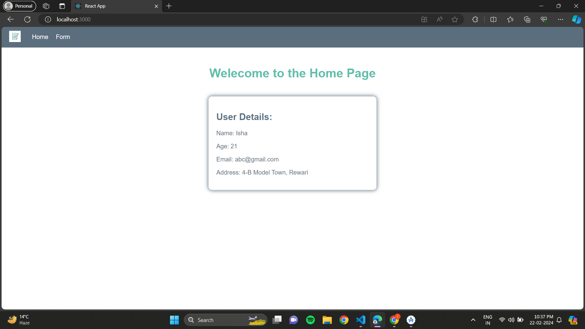

<body>
  <h1>EasyForm</h1>
  
EasyForm is a user-friendly React application designed to simplify the process of creating and filling out forms. With EasyForm, users can easily create custom forms, collect responses, and manage submissions effortlessly. The application features intuitive navigation and interactive features to streamline the entire form-building process.

  <h2>Features</h2>
  <ul>
    <li>Form Creation: Easily create custom forms tailored to your needs.</li>
    <li>Form Submission: Submit form details with ease and convenience.</li>
    <li>Form Management: Manage form submissions and responses effortlessly.</li>
    <li>User-Friendly Interface: Intuitive navigation and interactive features for seamless user experience.</li>
    <li>Responsive Design: Compatible with various devices for accessibility on the go.</li>
  </ul>

  <h2>How to Use</h2>
  <ol>
    <li>Clone Repository: Clone the EasyForm repository to your local machine.</li>
    <pre><code>git clone https://github.com/your-username/easyform.git</code></pre>
    <li>Install Dependencies: Navigate to the project directory and install dependencies.</li>
    <pre><code>cd easyform
npm install</code></pre>
    <li>Run the Application: Start the development server to run the application.</li>
    <pre><code>npm start</code></pre>
    <li>Create Forms: Use the FormAction component to create custom forms by entering details such as name, age, address, and email.</li>
    <li>Submit Forms: Fill out the form and click the "Submit" button. The form details will be submitted, and you will be redirected to the home page.</li>
    <li>View Responses: On the home page, you can view the submitted form details in a user-friendly layout.</li>
  </ol>

  <h2>Screenshots</h2>
  <figure>
    
    <figcaption>Create and fill out forms with ease.</figcaption>
  </figure>
  <figure>
    
    <figcaption>View submitted form details on the home page.</figcaption>
  </figure>

  <h2>Technologies Used</h2>
  <ul>
    <li>React</li>
    <li>React Router</li>
    <li>HTML</li>
    <li>CSS</li>
  </ul>

  <h2>Credits</h2>
  
This project was created by [Your Name].

</body>
</html>

